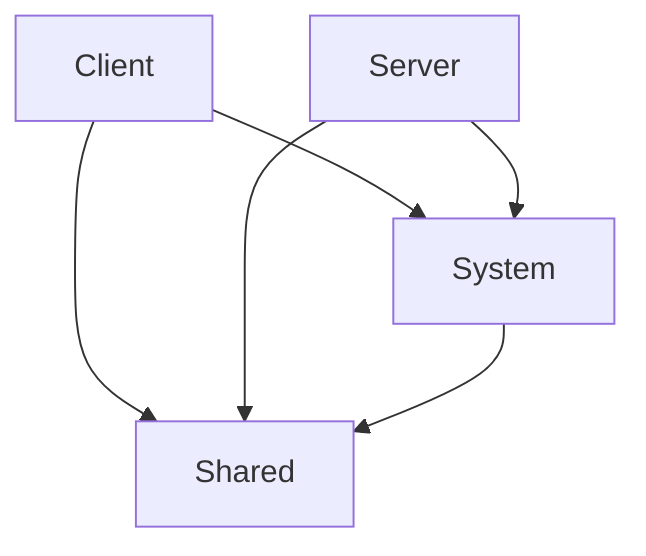

# Project Structure

The project is divided into several main components located under `ageofhexes-io/`:

## 1. Client (`client/`) [^client-src]
A Vite-powered TypeScript project.
- **Rendering**: Custom canvas-based renderer.
- **UI**: State-driven UI components.
- **Networking**: Client-side WebSocket handling.

## 2. Server (`server/`) [^server-src]
Node.js server using Express and `ws`.
- **Matchmaking**: Room-based game hosting.
- **AI**: Simple bot manager and queue systems.
- **Database**: Integration with Supabase for user data.

## 3. Shared (`shared/`) [^shared-src]
Universal TypeScript files containing constants, types, and utility functions used by both client and server.

## 4. Systems (`system/`) [^system-src]
The core game engine.
- **State Logic**: Game loop, ticking, and delta calculation.
- **Map Generation**: ASCII-based map definitions and instances.
- **Rules**: Implementation of game mechanics (capture, building, etc.).

# Dependency Graph

[^client-src]: /ageofhexes-io/client/src/
[^server-src]: /ageofhexes-io/server/src/
[^shared-src]: /ageofhexes-io/shared/
[^system-src]: /ageofhexes-io/system/
